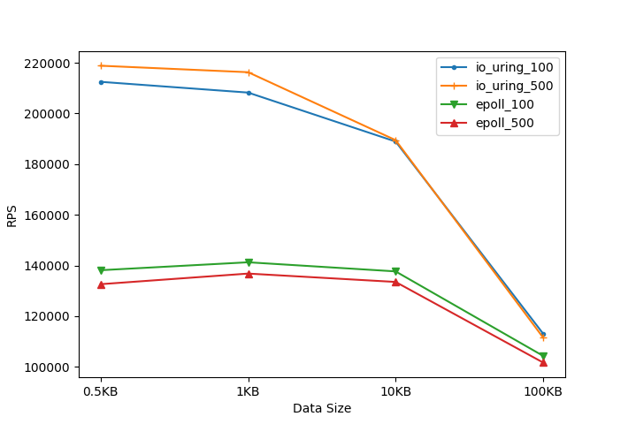
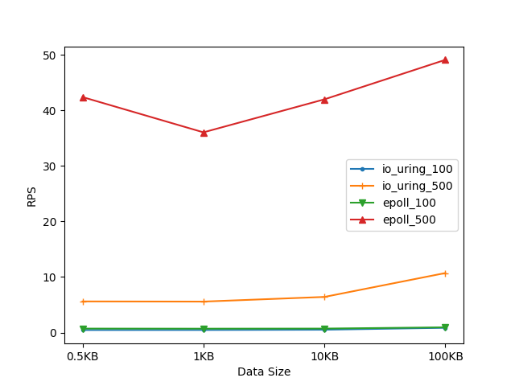

# io_uring Nginx server HTTP benchmarks

## Hardware Used
* CPU: ntel(R) Core(TM) i9-9900K CPU @ 3.60GHz 8 (16 HT) cores
* Memory: 32GB

## Software Used
* Version 4.1.0 of [wrk](https://github.com/wg/wrk)
    * Tested with 2 threads
* Version 1.19.5 of [NGINX with io_uring moudle](!@#$%^&) Open Source. Installed it according to [guide](https://docs.nginx.com/nginx/admin-guide/installing-nginx/installing-nginx-open-source/).
    * Tested with 2 worker processes and http `sendfile on;`
* Ubuntu 20.04.1 LTS with 5.7.0-050700-generic

## requirements to run the benchmarks
* Before installing NGINX, `make liburing` is required to use `use io_uring;`
* Linux Kernel 5.7 or higher required

## benchmark results
### Requests/sec

* io_uring

| clients    | 0.5KB | 1KB    | 10KB   | 100KB  |
|:----------:|:-----:|:------:|:------:|:------:|
| 100        | 212477| 208237 | 188917 | 113141 |
| 500        | 218831| 216274 | 189472 | 111582 | 

* epoll

| clients    | 0.5KB | 1KB    | 10KB   | 100KB  |
|:----------:|:-----:|:------:|:------:|:------:|
| 100        | 138144| 141272 | 137676 | 104349 |
| 500        | 132630| 136815 | 133514 | 101716 | 

### Avg Latency (ms)

* io_uring

| clients    | 0.5KB | 1KB    | 10KB   | 100KB  |
|:----------:|:-----:|:------:|:------:|:------:|
| 100        | 0.462 |  0.471 |  0.520 |   0.87 |
| 500        | 5.61  |  5.58  |  6.42  |  10.72 | 

* epoll

| clients    | 0.5KB | 1KB    | 10KB   | 100KB  |
|:----------:|:-----:|:------:|:------:|:------:|
| 100        | 0.722 | 0.706  | 0.724  |  0.95  |
| 500        | 42.39 | 36.04  | 41.98  |  49.09 | 

## extra info
* To move data between a file and a socket without copying between kernel address space and user address space, I implemented asynchronous sendfile of io_uring module using two `IORING_OP_SPLICE` requests and pipes.
However, performance of the splice requests is getting poor after accepting a client. I'm finding the reason of this problem.
Because of this problem, I implemented sendfile of ngx_uring_module with a read request and a send request. This makes copy between kernel space and user space.
This sendfile implementation has a high overhead when sending a big size of file.
To alleviate this, when sending a file over page size(4KB), ngx_uring_module uses a Linux sendfile() system call instead.

